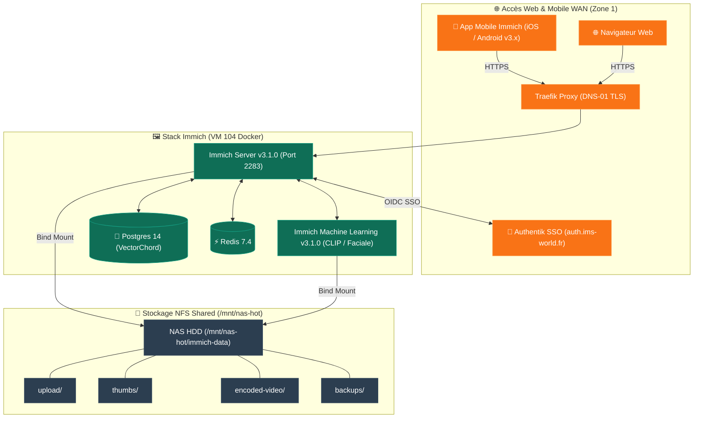

import { ips, domains } from "/snippets/variables.mdx";

<Badge color="green">🟢 Production Active (v3.1.0 — 61 880 Assets)</Badge>

## Accès Rapides & Administration

<Tabs>
  <Tab title="🌐 Interface Web">
    <Card title="Immich Web UI" icon="images" href="https://photos.ims-world.fr">
      Interface principale de consultation, sauvegarde et gestion de la médiathèque photo/vidéo sur `photos.ims-world.fr` (SSO Authentik).
    </Card>
  </Tab>
  <Tab title="⚡ Commandes CLI & Maintenance">
    ```bash
    # Se connecter à la VM Coolify
    ssh cmolotkoff@100.64.0.4

    # Accéder au dossier du service Immich
    cd /data/coolify/services/p3ujda5c7sc8nf4j9zzd8lck/

    # Inspecter les logs des 4 conteneurs (server, ML, database, redis)
    docker compose logs -f --tail=100

    # Vérifier l'existence des fichiers marqueurs .immich dans le volume NFS
    ls -la /mnt/nas-hot/immich-data/*/ | grep "\.immich"
    ```
  </Tab>
</Tabs>

---

## Fiche Service

| Propriété | Valeur |
|---|---|
| **Domaine** | `photos.ims-world.fr` |
| **Rôle** | Médiathèque photo/vidéo avec IA (reconnaissance faciale & recherche sémantique CLIP) |
| **Versions** | Immich `v3.1.0` / Postgres VectorChord `14-vectorchord0.3.0` / Redis `7.4-alpine` |
| **Hôte d'Orchestration** | VM IMS-Coolify (VM 104) |
| **UUID Coolify** | `p3ujda5c7sc8nf4j9zzd8lck` |
| **Chemin sur la VM** | `/data/coolify/services/p3ujda5c7sc8nf4j9zzd8lck/` |
| **Stockage NFS** | `/mnt/nas-hot/immich-data` (Tier `storage-hot` — accès fréquent) |
| **Authentification** | Native & SSO Authentik OIDC |
| **Statut** | <Badge color="green">🟢 Production Active</Badge> |

---

## Architecture & Topologie



---

## Composants & Stockage

### 1. Composants Applicatifs

| Conteneur | Image Docker | Rôle |
|---|---|---|
| **`immich-server`** | `ghcr.io/immich-app/immich-server:v3.1.0` | Serveur API principal et interface Web |
| **`immich-machine-learning`** | `ghcr.io/immich-app/immich-machine-learning:v3.1.0` | Moteur d'IA (reconnaissance faciale et recherche sémantique CLIP) |
| **`database`** | `ghcr.io/immich-app/postgres:14-vectorchord0.3.0-pgvectors0.2.0` | Base PostgreSQL enrichie de l'extension vectorielle VectorChord |
| **`redis`** | `redis:7.4-alpine` | File d'attente de tâches asynchrones et cache mémoire |

### 2. Organisation du Volume NFS (`/mnt/nas-hot/immich-data`)

| Dossier | Rôle & Usage |
|---|---|
| `upload/` | Fichiers bruts originaux importés depuis les smartphones ou l'interface web |
| `thumbs/` | Miniature générées par le serveur pour l'affichage rapide |
| `encoded-video/` | Transcodages vidéo optimisés pour le streaming web/mobile |
| `library/` | Structure organisée de la bibliothèque |
| `profile/` | Photos de profil des utilisateurs |
| `backups/` | Emplacement des exports et backups internes de l'application |

---

## Stockage & Politique de Sécurité

### 1. Double Bind-Mount Obligatoire

<Warning>
**Piège de configuration Coolify** : Le volume NFS `/mnt/nas-hot/immich-data:/usr/src/app/upload` **DOIT impérativement** être monté sur **les deux** conteneurs (`immich-server` ET `immich-machine-learning`). Le template Coolify par défaut ne monte ce dossier que sur le serveur — l'omettre sur le service ML casse silencieusement la génération de miniatures et la reconnaissance faciale.
</Warning>

### 2. Variables de Stockage & Base de Données
- **`DB_STORAGE_TYPE=SSD`** : Cette variable concerne **strictement le volume local de la base de données PostgreSQL** résidant sur le SSD NVMe de la VM Coolify. Elle n'impacte pas le stockage des photos sur le NAS.
- **Réseau Docker Externe** : Si la base de données est démarrée manuellement en CLI avant le premier déploiement via Coolify, créer au préalable le réseau externe Docker nommé d'après l'UUID du service (`docker network create p3ujda5c7sc8nf4j9zzd8lck`).

---

## Exploitation & Procédures

<AccordionGroup>
  <Accordion title="Contrôle d'Intégrité & Fichiers Marqueurs .immich (Folder Checks)">
    Immich effectue un contrôle strict d'intégrité au démarrage en vérifiant l'existence d'un fichier masqué **`.immich`** dans chacun des 6 sous-dossiers surveillés (`upload`, `library`, `thumbs`, `encoded-video`, `profile`, et `backups`).

    Si l'un de ces sous-dossiers (notamment `backups/`) ou son fichier marqueur est manquant, le serveur échoue avec l'erreur `ENOENT` et entre en **boot-loop infini**.

    **Procédure de création des marqueurs** :
    ```bash
    # Se positionner dans le dossier NFS
    cd /mnt/nas-hot/immich-data

    # Créer les sous-dossiers et poser le fichier marqueur .immich
    for dir in upload library thumbs encoded-video profile backups; do
      mkdir -p "$dir"
      touch "$dir/.immich"
    done
    ```
  </Accordion>

  <Accordion title="Synchronisation de la Version Majeure de l'App Mobile">
    <Warning>
    **Compatibilité Version Majeure Mobile/Serveur** : Le serveur Immich v3.x impose que l'application mobile (iOS / Android) soit également mise à jour en version **v3.x**. Une application mobile restée en v2.x échouera à se synchroniser avec le serveur.
    </Warning>
  </Accordion>
</AccordionGroup>
