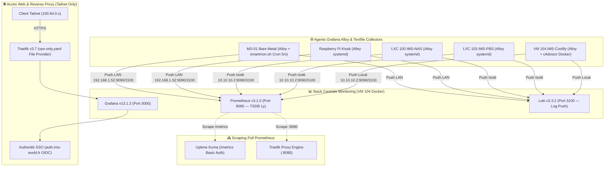

import { ips, domains } from "/snippets/variables.mdx";

<Badge color="green">🟢 Production Active (Stack LGTM + Grafana Alloy)</Badge>

## Accès Rapides & Administration

<Tabs>
  <Tab title="🌐 Interfaces Web">
    <CardGroup cols={2}>
      <Card title="Grafana (Dashboards, Logs & Alerting)" icon="chart-line" href="https://monitoring.ims-world.fr">
        Interface centrale de métrologie, d'exploration de logs Loki et de gestion des règles d'alerte. Accessible sur `monitoring.ims-world.fr` (Tailnet + SSO Authentik).
      </Card>
      <Card title="Ntfy — Notifications Push" icon="bell" href="/services/ntfy">
        Les notifications d'alerte Grafana sont délivrées via Ntfy (service dédié, voir la fiche Ntfy).
      </Card>
    </CardGroup>
  </Tab>
  <Tab title="⚡ Commandes CLI & Maintenance">
    ```bash
    # Se connecter à la VM Coolify
    ssh cmolotkoff@100.64.0.4

    # Accéder au dossier du service Monitoring
    cd /data/coolify/services/rrw19kmye6gng961igtzqpgw/

    # Logs des conteneurs (Grafana, Loki, Prometheus)
    docker compose logs -f --tail=100

    # Vérifier le statut de l'agent Alloy sur un hôte systemd
    sudo systemctl status alloy
    ```
  </Tab>
</Tabs>

---

## Fiche Service

| Propriété | Valeur |
|---|---|
| **Domaine** | `monitoring.ims-world.fr` |
| **Rôle** | Centralisation des Métriques (Prometheus), Logs (Loki) & Visualisation/Alerting (Grafana) |
| **Versions** | Grafana `13.1.3` / Loki `3.3.2` / Prometheus `v3.1.0` / Alloy `1.18.1` |
| **Hôte d'Orchestration** | VM IMS-Coolify (VM 104) |
| **UUID Coolify** | `rrw19kmye6gng961igtzqpgw` |
| **Chemin sur la VM** | `/data/coolify/services/rrw19kmye6gng961igtzqpgw/` |
| **Mode d'Ingestion** | **Push Remote-Write** (Alloy) + **Pull Scrape** (Uptime Kuma & Traefik) |
| **Rétention Métriques/Logs** | **1 An** (Prometheus TSDB `--storage.tsdb.retention.time=1y`) & **30j** (Loki `retention_period: 720h`) |
| **Statut** | <Badge color="green">🟢 Production Active</Badge> |

<Warning>
**Grafana 13.1.3 est requis**, pas une version antérieure. La fonctionnalité "Custom Payload" du contact point Webhook (utilisée pour formater les notifications Ntfy) n'existe qu'à partir de **Grafana 12.0** — absente en 11.x. Ne pas downgrade sans vérifier ce point.
</Warning>

<Info>
**Extrapolation Rétention 1 An** : La taille TSDB constatée sur 30 jours est de **464 Mo**. L'extrapolation sur 1 an représente environ **5 à 6 Go** de stockage, ce qui est tout à fait négligeable sur le stockage SSD 4 To de la VM Coolify.
</Info>

---

## Architecture & Topologie



### 1. IngestionHybride : Push Remote-Write + Pull Uptime Kuma/Traefik

- **Push Remote-Write (Alloy)** : Les 5 agents Alloy poussent leurs métriques (`prometheus.remote_write`) et leurs logs (`loki.write`) directement vers la stack centrale via le LAN ou le bridge isolé `vmbr1`. La télémétrie ne transite **jamais par Tailscale**.
- **Pull Uptime Kuma (Exception)** : Prometheus scrape l'endpoint natif `/metrics` d'Uptime Kuma via Basic Auth.
  - La clé API est stockée dans `config/uptime-kuma-api-key.txt` et montée en volume `:ro` dans le conteneur Prometheus (`/etc/prometheus/secrets/kuma-api-key`).
  - **Métriques lues** : `monitor_status`, `monitor_response_time_seconds`, `monitor_uptime_ratio`, `monitor_cert_days_remaining`, `monitor_cert_is_valid`.

<Warning>
**Bug de Création de Tag Uptime Kuma** : La création d'une étiquette (tag) dans l'IHM Uptime Kuma pendant que le conteneur tourne casse temporairement l'export `/metrics`.
**Fix** : Exécuter un redémarrage du conteneur après toute création d'étiquette :
```bash
docker restart uptime-kuma-il53bmpdybmss5q14sfy0umm
```
</Warning>

### 2. Monitoring SMART des Disques Physiques (`ms01-pve`)

Seul l'hôte Proxmox bare-metal a un accès matériel direct aux disques physiques (`nvme0n1`, `sda` SSD Samsung 870 EVO, `sdb` HDD Apple/Seagate). Les conteneurs LXC (NAS, PBS) ne remontent pas le numéro de série SMART.

- **Méthode** : *textfile collector* Node Exporter via Alloy, alimenté par le script communautaire `smartmon.sh` exécuté toutes les 5 minutes par cron.
- **Règle de Cron (`/etc/cron.d/smartmon`)** :
  ```bash
  PATH=/usr/local/sbin:/usr/local/bin:/usr/sbin:/usr/bin:/sbin:/bin
  */5 * * * * root /usr/local/bin/smartmon.sh > /var/lib/node_exporter/textfile_collector/smartmon.prom.$$ && mv /var/lib/node_exporter/textfile_collector/smartmon.prom.$$ /var/lib/node_exporter/textfile_collector/smartmon.prom
  ```

<Info>
**Respect du Spin-Down des Disques** : Le script `smartmon.sh` utilise nativement `smartctl -n standby`. Si un disque HDD (`sda`/`sdb`) est en veille, le script **saute la lecture SMART sans réveiller le disque** (`smartmon_device_active = 0`). Cela préserve le mode veille configuré (30 min d'inactivité).
</Info>

### 3. Métriques Traefik & Formatage des Services

Prometheus scrape les métriques de Traefik sur `coolify-proxy:8080`.

<Warning>
**Formatage des Noms de Services Coolify** : Les noms de services générés par Coolify contiennent des hashes et suffixes variables (ex. `https-N-<hash>-`, `@docker`, `@file`). Les dashboards Grafana utilisent une expression régulière `label_replace` en deux passes pour nettoyer ces libellés et afficher des noms lisibles.
</Warning>

### 4. Healthchecks Docker Nfs

```yaml
  prometheus:
    healthcheck:
      test: ['CMD', 'wget', '--no-verbose', '--tries=1', '--spider', 'http://localhost:9090/-/healthy']
  loki:
    healthcheck:
      test: ['CMD', 'wget', '--no-verbose', '--tries=1', '--spider', 'http://localhost:3100/ready']
  grafana:
    healthcheck:
      test: ['CMD-SHELL', 'wget --no-verbose --tries=1 --spider http://localhost:3000/api/health || exit 1']
```

---

## Dashboards Grafana

### Galerie des Tableaux de Bord

````carousel

<!-- slide -->

<!-- slide -->

<!-- slide -->

````

---

### Inventaire des Dashboards en Production

| Dashboard | Source | Description & Indicateurs Clés |
|---|---|---|
| **Vue d'ensemble — IMS-WORLD** | Custom | **Master Dashboard Exécutif** : Statut global des services (Uptime Kuma), taux de stockage, santé SMART disques, certificats SSL `<30j`, matrice CPU/RAM/Disque par hôte. |
| **Gestion des disques** | Custom | **Capacité & Santé Disques** : Taux d'occupation global, capacité totale/libre (6.27 TiB / 3.81 TiB), répartition Froid/Chaud, tendance 90j, I/O, inventaire physique, santé SMART et températures. |
| **Traefik — Reverse Proxy** | Custom | **Trafic Web & Proxy Engine** : Requêtes/s globales, taux d'erreurs 4xx/5xx (fenêtre 15m pour lisser le bruit), connexions ouvertes, top 10 services les plus demandés, latences. |
| **Uptime Kuma - Overview** | Custom | **Disponibilité Applicative** : Statut des 17 services, temps de réponse, validité et jours restants des certificats SSL, SLO (24h/7j/30j), historique chronologique des coupures. |
| **Node Exporter Full** | Grafana ID `1860` (Fixé) | **Vue Système par Hôte** : CPU, mémoire, I/O disque, réseau. *Note : Variables corrigées pour matcher les vrais labels (`job=integrations/unix`, `host=`).* |
| **Docker monitoring** | Grafana ID `15798` + Custom | **Métriques Conteneurs** : Consommation CPU/RAM/Network par conteneur Docker via cAdvisor. |
| **Logs — Vue d'ensemble** | Custom (`logs-overview.json`) | **Explorateur de Logs Loki** : Filtrable par `$host`, `$job`, `$container` et `$level` (ERROR, WARN, INFO). |

---

## Alerting & Contact Point Ntfy

Grafana gère l'évaluation des règles d'alerte et transmet les notifications push à **[Ntfy](/services/ntfy)** via un contact point Webhook.

### 1. Configuration du Contact Point Webhook
- **URL** : `https://ntfy.ims-world.fr`
- **Méthode HTTP** : `POST`
- **Header d'autorisation** : `Bearer <token_ntfy_grafana>`
- **Custom Payload (Grafana ≥ 12.0)** :
```json
{{ $msg := "" }}
{{ range .Alerts }}{{ $msg = printf "%s%s (%s)\n" $msg .Annotations.summary .Labels.host }}{{ end }}
{{ if eq .Status "firing" }}{
  "topic": "ims-alerts",
  "title": {{ printf "%s" .CommonLabels.alertname | data.ToJSON }},
  "message": {{ $msg | data.ToJSON }},
  "priority": 4,
  "tags": ["rotating_light"],
  "click": {{ .ExternalURL | data.ToJSON }}
}
{{ else }}{
  "topic": "ims-alerts",
  "title": {{ printf "Résolu: %s" .CommonLabels.alertname | data.ToJSON }},
  "message": {{ $msg | data.ToJSON }},
  "priority": 3,
  "tags": ["white_check_mark"]
}
{{ end }}
```

### 2. Règles d'Alerte Grafana (Group `default`)

| Règle | Requête PromQL (Instant) | Condition | Pending | No data state |
|---|---|---|---|---|
| **CPU élevé** | `100 - (avg by (host) (rate(node_cpu_seconds_total{mode="idle"}[5m])) * 100)` | > 90% | 5m | Normal |
| **RAM élevée** | `(1 - node_memory_MemAvailable_bytes / node_memory_MemTotal_bytes) * 100` | > 90% | 5m | Normal |
| **Disque plein** | `(1 - node_filesystem_avail_bytes{fstype!~"tmpfs\|overlay"} / node_filesystem_size_bytes) * 100` | > 85% | 10m | Normal |
| **Host down** | `time() - timestamp(node_load1) > 120` | > 120s | 1m | Normal |
| **Container crash-loop** | `changes(container_start_time_seconds{image!="", host="ims-coolify"}[15m])` | > 2 | 0s | Normal |
