import { ips, domains } from "/snippets/variables.mdx";

<Badge color="green">🟢 Production Active (Stack LGTM + Grafana Alloy)</Badge>

## Accès Rapides & Administration

<Tabs>
  <Tab title="🌐 Interfaces Web">
    <CardGroup cols={2}>
      <Card title="Grafana (Dashboards & Logs)" icon="chart-line" href="https://monitoring.ims-world.fr">
        Interface centrale de métrologie et d'exploration de logs Loki. Accessible sur `monitoring.ims-world.fr` (Tailnet + SSO Authentik).
      </Card>
      <Card title="Console Authentik Admin" icon="shield-halved" href="https://auth.ims-world.fr">
        Provider d'identité OIDC gérant les rôles et accès SSO Grafana.
      </Card>
    </CardGroup>
  </Tab>
  <Tab title="🔐 SSO Authentik & Connexion">
    - **Authentification Principale** : Bouton *Sign in with authentik* via OIDC natif.
    - **Application Authentik** : Provider OAuth2/OIDC, slug `grafana`.
    - **Rôles RBAC (Entitlements)** : `Grafana Admins` (Admin), `Grafana Editors` (Éditeur), `Grafana Viewers` (Lecteur).
    - **Compte Admin Local** : Compte de secours configuré via Coolify (`GF_USERS_ALLOW_SIGN_UP=false`).
  </Tab>
  <Tab title="⚡ Commandes CLI & Maintenance">
    ```bash
    # Se connecter à la VM Coolify
    ssh cmolotkoff@100.64.0.4

    # Accéder au dossier du service Monitoring
    cd /data/coolify/services/rrw19kmye6gng961igtzqpgw/

    # Logs des conteneurs (Grafana, Loki, Prometheus)
    docker compose logs -f --tail=100

    # Vérifier le statut de l'agent Alloy sur un hôte systemd
    sudo systemctl status alloy
    ```
  </Tab>
</Tabs>

---

## Fiche Service

| Propriété | Valeur |
|---|---|
| **Domaine** | `monitoring.ims-world.fr` |
| **Rôle** | Centralisation des Métriques (Prometheus), Logs (Loki) & Visualisation (Grafana) |
| **Versions** | Grafana `11.4.0` / Loki `3.3.2` / Prometheus `v3.1.0` / Alloy `1.18.1` |
| **Hôte d'Orchestration** | VM IMS-Coolify (VM 104) |
| **UUID Coolify** | `rrw19kmye6gng961igtzqpgw` |
| **Chemin sur la VM** | `/data/coolify/services/rrw19kmye6gng961igtzqpgw/` |
| **Mode d'Ingestion** | **Push Remote-Write** (les 5 agents Alloy poussent vers le serveur) |
| **Rétention Métriques/Logs** | 30 jours (Prometheus TSDB `--storage.tsdb.retention.time=30d` & Loki `retention_period: 720h`) |
| **Statut** | <Badge color="green">🟢 Production Active</Badge> |

---

## Architecture & Topologie (Push Remote-Write)

```mermaid
graph TB
    subgraph INGRESS ["🌐 Accès Web & Reverse Proxy (Tailnet Only)"]
        CLIENT_VPN["Client Tailnet (100.64.0.x)"]
        TRAEFIK["Traefik v3.7 (vpn-only@file)"]
        AUTHENTIK["Authentik SSO (auth.ims-world.fr)"]
    end

    subgraph CENTRAL_STACK ["📊 Stack Centrale Monitoring (VM 104 Docker)"]
        GRAFANA["Grafana v11.4.0 (Port 3000)"]
        PROMETHEUS["Prometheus v3.1.0 (Port 9090 — Remote Write)"]
        LOKI["Loki v3.3.2 (Port 3100 — Log Push)"]
    end

    subgraph AGENTS ["⚙️ Agents Grafana Alloy (5 Hôtes Surveillés)"]
        MS01_ALLOY["MS-01 Host Bare Metal (Alloy systemd)"]
        NAS_ALLOY["LXC 100 IMS-NAS (Alloy systemd)"]
        PBS_ALLOY["LXC 103 IMS-PBS (Alloy systemd)"]
        COOL_ALLOY["VM 104 IMS-Coolify (Alloy root systemd + cAdvisor)"]
        RPI_ALLOY["Raspberry Pi Kiosk (Alloy systemd)"]
    end

    CLIENT_VPN -->|HTTPS| TRAEFIK
    TRAEFIK --> GRAFANA
    GRAFANA <-->|SSO OIDC| AUTHENTIK
    GRAFANA -->|Query| PROMETHEUS
    GRAFANA -->|Query LogQL| LOKI

    MS01_ALLOY -->|Push LAN 192.168.1.52:9090/3100| PROMETHEUS
    MS01_ALLOY -->|Push LAN| LOKI

    RPI_ALLOY -->|Push LAN 192.168.1.52:9090/3100| PROMETHEUS
    RPI_ALLOY -->|Push LAN| LOKI

    NAS_ALLOY -->|Push Isolé 10.10.10.2:9090/3100| PROMETHEUS
    NAS_ALLOY -->|Push Isolé| LOKI

    PBS_ALLOY -->|Push Isolé 10.10.10.2:9090/3100| PROMETHEUS
    PBS_ALLOY -->|Push Isolé| LOKI

    COOL_ALLOY -->|Push Local 10.10.10.2:9090/3100| PROMETHEUS
    COOL_ALLOY -->|Push Local| LOKI

    classDef web fill:#F97316,stroke:#FB923C,color:#fff;
    classDef central fill:#0F6E56,stroke:#16A085,color:#fff;
    classDef agent fill:#1a2b3c,stroke:#F97316,color:#fff;
    class CLIENT_VPN,TRAEFIK,AUTHENTIK web;
    class GRAFANA,PROMETHEUS,LOKI central;
    class MS01_ALLOY,NAS_ALLOY,PBS_ALLOY,COOL_ALLOY,RPI_ALLOY agent;
```



<Info>
**Décision d'architecture clé : Push, pas Pull.** Chaque agent Alloy (5 hôtes) pousse ses métriques (`prometheus.remote_write`) et ses logs (`loki.write`) vers le serveur central via le LAN ou le réseau isolé `vmbr1`. Le port HTTP d'Alloy (12345) reste strictement local. La télémétrie ne transite **jamais par Tailscale**, ce qui garantit que la collecte continue même en cas de coupure du VPN Headscale.
</Info>

---

## Composants & Fonctionnement

### 1. Hôtes Surveillés par Grafana Alloy

| Hôte | Type | Adresse de Push Utilisée | Label `host` | Source des Logs & Métriques |
|---|---|---|---|---|
| **Host Proxmox (MS-01)** | Bare metal | `192.168.1.52:9090 / 3100` (LAN) | `ms01-pve` | `unix` exporter + systemd journal |
| **IMS-NAS** | LXC 100 unprivileged | `10.10.10.2:9090 / 3100` (vmbr1) | `ims-nas` | `unix` exporter + systemd journal |
| **IMS-PBS** | LXC 103 unprivileged | `10.10.10.2:9090 / 3100` (vmbr1) | `ims-pbs` | `unix` exporter + systemd journal |
| **IMS-Coolify** | VM 104 Docker | `10.10.10.2:9090 / 3100` (Local) | `ims-coolify` | `unix` exporter + systemd journal + cAdvisor Docker + logs conteneurs |
| **Raspberry Pi** | Bare metal ARM | `192.168.1.52:9090 / 3100` (LAN) | `rpi-kiosk` | `unix` exporter + systemd journal |

---

### 2. Intégration SSO Authentik OIDC

Grafana combine un **double verrouillage de sécurité** : restreint au réseau Tailscale (`vpn-only@file`) ET authentifié par SSO Authentik.

#### Configuration Côté Authentik (`https://auth.ims-world.fr`)
- **Application & Provider** : Slug `grafana`, Type OAuth2 / OpenID Connect.
- **Redirect URIs** : `https://monitoring.ims-world.fr/login/generic_oauth`
- **Logout URI** : `https://monitoring.ims-world.fr/logout`
- **Rôles RBAC (Application Entitlements)** :
  - `Grafana Admins` ➔ Attribue le rôle `Admin` dans Grafana.
  - `Grafana Editors` ➔ Attribue le rôle `Editor` dans Grafana.
  - `Grafana Viewers` ➔ Attribue le rôle `Viewer` dans Grafana.

#### Configuration Côté Grafana UI (Administration → Authentication → authentik)
```ini
Auth URL : https://auth.ims-world.fr/application/o/authorize/
Token URL : https://auth.ims-world.fr/application/o/token/
API URL : https://auth.ims-world.fr/application/o/userinfo/
Sign out redirect URL : https://auth.ims-world.fr/application/o/grafana/end-session/
Scopes : openid profile email entitlements
Role attribute path : contains(entitlements[*], 'Grafana Admins') && 'Admin' || contains(entitlements[*], 'Grafana Editors') && 'Editor' || 'Viewer'
```

<Warning>
**Piège Client ID/Secret** : Si les identifiants sont régénérés dans Authentik, ils doivent obligatoirement être re-collés dans la console Grafana UI, sous peine d'erreur `Client ID Error: the client identifier is missing or invalid` lors du login SSO.
</Warning>

---

## Stockage & Politique de Sécurité

### 1. Masquage DNS & Isolation Réseau
- **DNS Public OVH** : Le nom `monitoring.ims-world.fr` pointe vers `127.0.0.1` (loopback). Toute tentative d'accès depuis le Web public échoue immédiatement sans atteindre le serveur.
- **Headscale Split-DNS** : Les clients enregistrés sur le Tailnet résolvent `monitoring.ims-world.fr` vers l'IP Tailscale réelle de la VM Coolify (`100.64.0.4`).
- **Traefik `vpn-only`** : Traefik rejette en **HTTP 403** toute requête ne provenant pas de `100.64.0.0/10`.

<Warning>
**Piège des Routeurs Coolify** : Ne jamais renseigner le champ *Domains* dans l'UI Coolify pour ce service. Coolify créerait un routeur Traefik parallèle sans le middleware `vpn-only`. Vérification post-déploiement :
```bash
docker inspect grafana-rrw19kmye6gng961igtzqpgw --format '{{json .Config.Labels}}' | python3 -m json.tool
```
Seuls les routeurs `traefik.http.routers.monitoring.*` doivent figurer.
</Warning>

### 2. Permissions Linux & Service Systemd Root
- Sur les hôtes nus, Alloy tourne sous l'utilisateur `alloy` rattaché aux groupes `adm` et `systemd-journal`.
- Sur la VM IMS-Coolify, la collecte cAdvisor nécessite un accès au socket `containerd` (`/run/containerd/containerd.sock` `root:root`). Alloy est configuré via un override systemd pour s'exécuter sous **root** :
```ini
# /etc/systemd/system/alloy.service.d/override.conf
[Service]
User=root
```

---

## Exploitation & Procédures

<AccordionGroup>
  <Accordion title="Procédure : Ajouter un Nouvel Hôte à Surveiller">
    <Steps>
      <Step title="Installation du binaire Alloy via le dépôt officiel">
        ```bash
        sudo apt install -y gpg
        sudo mkdir -p /etc/apt/keyrings
        sudo wget -O /etc/apt/keyrings/grafana.asc https://apt.grafana.com/gpg-full.key
        sudo chmod 644 /etc/apt/keyrings/grafana.asc
        echo "deb [signed-by=/etc/apt/keyrings/grafana.asc] https://apt.grafana.com stable main" | sudo tee /etc/apt/sources.list.d/grafana.list
        sudo apt-get update && sudo apt-get install -y alloy
        ```
      </Step>
      <Step title="Détermination de l'adresse de Push">
        - Si l'hôte est sur le réseau isolé `vmbr1` ➔ Utiliser `http://10.10.10.2:9090/api/v1/write` et `http://10.10.10.2:3100/loki/api/v1/push`.
        - Si l'hôte est sur le LAN ➔ Utiliser `http://192.168.1.52:9090/api/v1/write` et `http://192.168.1.52:3100/loki/api/v1/push`.
      </Step>
      <Step title="Configuration de /etc/alloy/config.alloy">
        Remplacer intégralement le fichier d'exemple `/etc/alloy/config.alloy` avec les blocs `prometheus.exporter.unix`, `prometheus.remote_write` et `loki.source.journal`. Saisir le label de l'hôte (`host = "ims-xxx"`).
      </Step>
      <Step title="Activation des permissions et démarrage">
        ```bash
        sudo usermod -aG adm,systemd-journal alloy
        sudo systemctl restart alloy && sudo systemctl enable alloy
        ```
      </Step>
      <Step title="Validation de l'ingestion">
        ```bash
        curl -s -G 'http://192.168.1.52:9090/api/v1/query' --data-urlencode 'query=node_load1{host="ims-xxx"}'
        curl -s -G 'http://192.168.1.52:3100/loki/api/v1/label/host/values'
        ```
      </Step>
    </Steps>
  </Accordion>

  <Accordion title="Requêtes PromQL & LogQL Utiles">
    **PromQL — Nettoyage des suffixes UUID Coolify sur les conteneurs** :
    ```promql
    label_replace(
      sum by (name) (rate(container_cpu_usage_seconds_total{image!="", host="ims-coolify"}[5m])) * 100,
      "short_name", "$1", "name", "^(.+?)(-[a-z0-9]{20,})?$"
    )
    ```

    **LogQL — Journal Systemd & Conteneurs Docker** :
    ```logql
    {host="ms01-pve"}                               # Tous les logs du host Proxmox
    {host="ims-coolify", job="docker-containers"}   # Tous les logs des conteneurs Docker
    {host="ims-coolify", compose_service="grafana"} # Logs d'un conteneur spécifique
    ```
  </Accordion>

  <Accordion title="Roadmap & TODOs Restants">
    - [ ] **Dashboard Traefik** : Activer `metrics.prometheus` sur l'instance Traefik Coolify et importer le dashboard Grafana `17346`.
    - [ ] **Alerting Ntfy** : Déployer l'instance Ntfy et connecter le Contact Point Grafana.
    - [ ] **Règles d'alerte Grafana** : Définir les seuils d'alerte CPU/RAM/Disque et détection de conteneurs KO.
  </Accordion>
</AccordionGroup>
