import { ips, domains } from "/snippets/variables.mdx";

<Badge color="green">🟢 Production Active (Stack LGTM + Grafana Alloy)</Badge>

## Accès Rapides & Administration

<Tabs>
  <Tab title="🌐 Interfaces Web">
    <CardGroup cols={2}>
      <Card title="Grafana (Dashboards, Logs & Alerting)" icon="chart-line" href="https://monitoring.ims-world.fr">
        Interface centrale de métrologie, d'exploration de logs Loki et de gestion des règles d'alerte. Accessible sur `monitoring.ims-world.fr` (Tailnet + SSO Authentik).
      </Card>
      <Card title="Ntfy — Notifications Push" icon="bell" href="/services/ntfy">
        Les notifications d'alerte Grafana sont délivrées via Ntfy (service dédié, voir la fiche Ntfy).
      </Card>
    </CardGroup>
  </Tab>
  <Tab title="⚡ Commandes CLI & Maintenance">
    ```bash
    # Se connecter à la VM Coolify
    ssh cmolotkoff@100.64.0.4

    # Accéder au dossier du service Monitoring
    cd /data/coolify/services/rrw19kmye6gng961igtzqpgw/

    # Logs des conteneurs (Grafana, Loki, Prometheus)
    docker compose logs -f --tail=100

    # Vérifier le statut de l'agent Alloy sur un hôte systemd
    sudo systemctl status alloy
    ```
  </Tab>
</Tabs>

---

## Fiche Service

| Propriété | Valeur |
|---|---|
| **Domaine** | `monitoring.ims-world.fr` |
| **Rôle** | Centralisation des Métriques (Prometheus), Logs (Loki) & Visualisation/Alerting (Grafana) |
| **Versions** | Grafana `13.1.3` / Loki `3.3.2` / Prometheus `v3.1.0` / Alloy `1.18.1` |
| **Hôte d'Orchestration** | VM IMS-Coolify (VM 104) |
| **UUID Coolify** | `rrw19kmye6gng961igtzqpgw` |
| **Chemin sur la VM** | `/data/coolify/services/rrw19kmye6gng961igtzqpgw/` |
| **Mode d'Ingestion** | **Push Remote-Write** (les 5 agents Alloy poussent vers le serveur) |
| **Rétention Métriques/Logs** | 30 jours (Prometheus TSDB `--storage.tsdb.retention.time=30d` & Loki `retention_period: 720h`) |
| **Statut** | <Badge color="green">🟢 Production Active</Badge> |

<Warning>
**Grafana 13.1.3 est requis**, pas une version antérieure. La fonctionnalité "Custom Payload" du contact point Webhook (utilisée pour formater les notifications Ntfy) n'existe qu'à partir de **Grafana 12.0** — absente en 11.x. Ne pas downgrade sans vérifier ce point.
</Warning>

---

## Architecture & Topologie (Push Remote-Write)

```mermaid
graph TB
    subgraph INGRESS ["🌐 Accès Web & Reverse Proxy (Tailnet Only)"]
        CLIENT_VPN["Client Tailnet (100.64.0.x)"]
        TRAEFIK["Traefik v3.7 (vpn-only@file)"]
        AUTHENTIK["Authentik SSO (auth.ims-world.fr)"]
    end

    subgraph CENTRAL_STACK ["📊 Stack Centrale Monitoring (VM 104 Docker)"]
        GRAFANA["Grafana v13.1.3 (Port 3000)"]
        PROMETHEUS["Prometheus v3.1.0 (Port 9090 — Remote Write)"]
        LOKI["Loki v3.3.2 (Port 3100 — Log Push)"]
    end

    subgraph AGENTS ["⚙️ Agents Grafana Alloy (5 Hôtes Surveillés)"]
        MS01_ALLOY["MS-01 Host Bare Metal (Alloy systemd)"]
        NAS_ALLOY["LXC 100 IMS-NAS (Alloy systemd)"]
        PBS_ALLOY["LXC 103 IMS-PBS (Alloy systemd)"]
        COOL_ALLOY["VM 104 IMS-Coolify (Alloy root systemd + cAdvisor + Traefik metrics)"]
        RPI_ALLOY["Raspberry Pi Kiosk (Alloy systemd)"]
    end

    CLIENT_VPN -->|HTTPS| TRAEFIK
    TRAEFIK --> GRAFANA
    GRAFANA <-->|SSO OIDC| AUTHENTIK
    GRAFANA -->|Query| PROMETHEUS
    GRAFANA -->|Query LogQL| LOKI
    GRAFANA -.->|Webhook Alerting| NTFY_EXT["Ntfy (ntfy.ims-world.fr)"]

    MS01_ALLOY -->|Push LAN 192.168.1.52:9090/3100| PROMETHEUS
    MS01_ALLOY -->|Push LAN| LOKI

    RPI_ALLOY -->|Push LAN 192.168.1.52:9090/3100| PROMETHEUS
    RPI_ALLOY -->|Push LAN| LOKI

    NAS_ALLOY -->|Push Isolé 10.10.10.2:9090/3100| PROMETHEUS
    NAS_ALLOY -->|Push Isolé| LOKI

    PBS_ALLOY -->|Push Isolé 10.10.10.2:9090/3100| PROMETHEUS
    PBS_ALLOY -->|Push Isolé| LOKI

    COOL_ALLOY -->|Push Local 10.10.10.2:9090/3100| PROMETHEUS
    COOL_ALLOY -->|Push Local| LOKI

    classDef web fill:#F97316,stroke:#FB923C,color:#fff;
    classDef central fill:#0F6E56,stroke:#16A085,color:#fff;
    classDef agent fill:#1a2b3c,stroke:#F97316,color:#fff;
    classDef ext fill:#333,stroke:#777,color:#fff,stroke-dasharray: 5 5;
    class CLIENT_VPN,TRAEFIK,AUTHENTIK web;
    class GRAFANA,PROMETHEUS,LOKI central;
    class MS01_ALLOY,NAS_ALLOY,PBS_ALLOY,COOL_ALLOY,RPI_ALLOY agent;
    class NTFY_EXT ext;
```



<Info>
**Décision d'architecture clé : Push, pas Pull.** Chaque agent Alloy (5 hôtes) pousse ses métriques (`prometheus.remote_write`) et ses logs (`loki.write`) vers le serveur central via le LAN ou le réseau isolé `vmbr1`. Le port HTTP d'Alloy (12345) reste strictly local. La télémétrie ne transite **jamais par Tailscale**, ce qui garantit que la collecte continue même en cas de coupure du control plane Headscale ou du Tailnet.
</Info>

---

## Composants & Dashboards

### 1. Hôtes Surveillés par Grafana Alloy

| Hôte | Type | Adresse de Push Utilisée | Label `host` | Source des Logs & Métriques |
|---|---|---|---|---|
| **Host Proxmox (MS-01)** | Bare metal | `192.168.1.52:9090 / 3100` (LAN) | `ms01-pve` | `unix` exporter + systemd journal |
| **IMS-NAS** | LXC 100 unprivileged | `10.10.10.2:9090 / 3100` (vmbr1) | `ims-nas` | `unix` exporter + systemd journal |
| **IMS-PBS** | LXC 103 unprivileged | `10.10.10.2:9090 / 3100` (vmbr1) | `ims-pbs` | `unix` exporter + systemd journal |
| **IMS-Coolify** | VM 104 Docker | `10.10.10.2:9090 / 3100` (Local) | `ims-coolify` | `unix` exporter + systemd journal + cAdvisor Docker + logs conteneurs + métriques Traefik |
| **Raspberry Pi** | Bare metal ARM | `192.168.1.52:9090 / 3100` (LAN) | `rpi-kiosk` | `unix` exporter + systemd journal |

---

### 2. Dashboards Installés

| Dashboard | Origine | Contenu |
|---|---|---|
| **Node Exporter Full** | Grafana.com ID `1860` | Vue par hôte : CPU/RAM/disque/réseau, filtrable par `Nodename`/`Instance` |
| **Docker monitoring** | Grafana.com ID `15798` + 4 panels custom | Vue globale containers + panels sur-mesure CPU/RAM/Réseau/Disk par container |
| **Traefik Standalone** | Grafana.com ID `17346` | Requêtes par entrypoint, Apdex, codes HTTP, services les plus lents/demandés |
| **Logs — Vue d'ensemble** | Custom (`dashboards/logs-overview.json`) | Flux de logs filtrable (`$host`/`$job`/`$container`/`$level`), volumes et erreurs |

---

## Alerting & Contact Point Ntfy

Grafana gère l'évaluation des règles d'alerte et transmet les notifications push à **[Ntfy](/services/ntfy)** via un contact point Webhook.

### 1. Configuration du Contact Point Webhook
- **URL** : `https://ntfy.ims-world.fr`
- **Méthode HTTP** : `POST`
- **Header d'autorisation** : `Bearer <token_ntfy_grafana>`
- **Custom Payload (Grafana ≥ 12.0)** :
```json
{{ $msg := "" }}
{{ range .Alerts }}{{ $msg = printf "%s%s (%s)\n" $msg .Annotations.summary .Labels.host }}{{ end }}
{{ if eq .Status "firing" }}{
  "topic": "ims-alerts",
  "title": {{ printf "%s" .CommonLabels.alertname | data.ToJSON }},
  "message": {{ $msg | data.ToJSON }},
  "priority": 4,
  "tags": ["rotating_light"],
  "click": {{ .ExternalURL | data.ToJSON }}
}
{{ else }}{
  "topic": "ims-alerts",
  "title": {{ printf "Résolu: %s" .CommonLabels.alertname | data.ToJSON }},
  "message": {{ $msg | data.ToJSON }},
  "priority": 3,
  "tags": ["white_check_mark"]
}
{{ end }}
```

### 2. Règles d'Alerte Grafana (Group `default`)

| Règle | Requête PromQL (Instant) | Condition | Pending | No data state |
|---|---|---|---|---|
| **CPU élevé** | `100 - (avg by (host) (rate(node_cpu_seconds_total{mode="idle"}[5m])) * 100)` | > 90% | 5m | Normal |
| **RAM élevée** | `(1 - node_memory_MemAvailable_bytes / node_memory_MemTotal_bytes) * 100` | > 90% | 5m | Normal |
| **Disque plein** | `(1 - node_filesystem_avail_bytes{fstype!~"tmpfs\|overlay"} / node_filesystem_size_bytes) * 100` | > 85% | 10m | Normal |
| **Host down** | `time() - timestamp(node_load1) > 120` | > 120s | 1m | Normal |
| **Container crash-loop** | `changes(container_start_time_seconds{image!="", host="ims-coolify"}[15m])` | > 2 | 0s | Normal |

---

## Exploitation & Procédures

<AccordionGroup>
  <Accordion title="Procédure : Ajouter un Nouvel Hôte à Surveiller (Alloy)">
    <Steps>
      <Step title="Installation d'Alloy via apt">
        ```bash
        sudo apt install -y gpg
        sudo mkdir -p /etc/apt/keyrings
        sudo wget -O /etc/apt/keyrings/grafana.asc https://apt.grafana.com/gpg-full.key
        sudo chmod 644 /etc/apt/keyrings/grafana.asc
        echo "deb [signed-by=/etc/apt/keyrings/grafana.asc] https://apt.grafana.com stable main" | sudo tee /etc/apt/sources.list.d/grafana.list
        sudo apt-get update && sudo apt-get install -y alloy
        ```
      </Step>
      <Step title="Configuration & Démarrage">
        Editer `/etc/alloy/config.alloy` avec les endpoints de push (`10.10.10.2` ou `192.168.1.52`), puis :
        ```bash
        sudo usermod -aG adm,systemd-journal alloy
        sudo systemctl restart alloy && sudo systemctl enable alloy
        ```
      </Step>
    </Steps>
  </Accordion>

  <Accordion title="Procédure : Créer une Nouvelle Règle d'Alerte Grafana → Ntfy">
    <Steps>
      <Step title="Création de la règle">
        Dans Grafana : **Alerting → Alert rules → New alert rule**, saisir la requête PromQL en mode **Instant**.
      </Step>
      <Step title="Configuration du No Data State">
        Régler "No data state" sur **Normal** pour éviter les fausses alertes sur requêtes saines vides.
      </Step>
      <Step title="Attribution du Contact Point">
        Sélectionner le contact point Webhook **Ntfy alerting**.
      </Step>
    </Steps>
  </Accordion>

  <Accordion title="Requêtes PromQL & LogQL Utiles">
    **PromQL — Nettoyage des suffixes UUID Coolify sur les conteneurs** :
    ```promql
    label_replace(
      sum by (name) (rate(container_cpu_usage_seconds_total{image!="", host="ims-coolify"}[5m])) * 100,
      "short_name", "$1", "name", "^(.+?)(-[a-z0-9]{20,})?$"
    )
    ```

    **LogQL — Journal Systemd & Conteneurs Docker** :
    ```logql
    {host="ms01-pve"}                               # Tous les logs du host Proxmox
    {host="ims-coolify", job="docker-containers"}   # Tous les logs des conteneurs Docker
    ```
  </Accordion>
</AccordionGroup>
