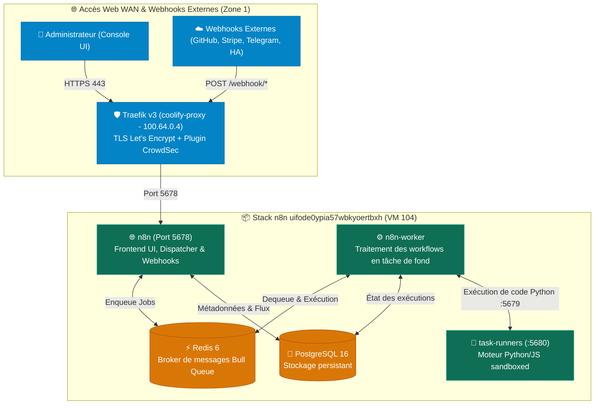

import { ips, domains } from "/snippets/variables.mdx";

<Badge color="green">🟢 Production Active (Queue Mode Multi-Workers)</Badge>

## Accès Rapides & Administration

<Tabs>
  <Tab title="🌐 Interface Web">
    <Card title="n8n Web UI" icon="diagram-project" href="https://automation.ims-world.fr">
      Console de conception de workflows, gestion des credentials et webhooks sur `automation.ims-world.fr`.
    </Card>
  </Tab>
  <Tab title="⚡ Commandes CLI & Maintenance">
    ```bash
    # Se connecter en SSH à la VM Coolify (VM 104)
    ssh cmolotkoff@100.64.0.4

    # Accéder au dossier du service n8n sur Coolify
    cd /data/coolify/services/uifode0ypia57wbkyoertbxh/

    # Inspecter l'état des 5 conteneurs de la stack
    docker compose ps

    # Consulter les logs en temps réel du serveur web et des workers
    docker compose logs -f --tail=50 n8n n8n-worker task-runners

    # Sauvegarde à chaud de la base PostgreSQL n8n
    docker exec -t $(docker ps -qf "name=postgresql-uifode0ypia57wbkyoertbxh") pg_dump -U n8n -d n8n | gzip > /tmp/backup_n8n_$(date +%F).sql.gz
    ```
  </Tab>
</Tabs>

---

## Fiche Service

| Propriété | Valeur |
|---|---|
| **Domaine Web** | `automation.ims-world.fr` |
| **Rôle** | Automatisation de flux, récepteur de webhooks, intégrations API et scripts domotiques |
| **Version n8n** | `2.10.4` (Template Coolify Queue Mode) |
| **Mode d'Exécution** | **Queue Mode** (Broker Redis + Worker dédié + Task Runners isolés) |
| **Hôte d'Orchestration** | VM IMS-Coolify (VM 104, `192.168.1.52`) |
| **UUID Coolify** | `uifode0ypia57wbkyoertbxh` |
| **Chemin sur la VM** | `/data/coolify/services/uifode0ypia57wbkyoertbxh/` |
| **Base de Données** | PostgreSQL 16 (`postgres:16-alpine`) |
| **Broker de Queue** | Redis 6 (`redis:6-alpine`) |
| **Runners de Code** | `n8nio/runners:2.10.4` (Exécution Python natif sandboxed) |
| **Zone Réseau & Exposition** | **Zone 1 (Public WAN)** — Chiffrement TLS 1.3 Let's Encrypt (DNS-01 OVH) + Bouncer CrowdSec |
| **Authentification** | **Native n8n** (User Management avec 2FA / MFA TOTP) |
| **Webhooks** | Endpoints publics traversants (`/webhook/*` et `/webhook-test/*`) |
| **Statut** | <Badge color="green">🟢 Production Active</Badge> |

---

## Architecture & Topologie (Queue Mode)

La stack n8n est déployée selon le pattern haute résilience **Queue Mode**, séparant l'interface web de la charge de calcul :



---

## Composants de la Stack (5 Conteneurs)

| Conteneur | Image | Rôle |
|---|---|---|
| **`n8n`** | `n8nio/n8n:2.10.4` | Serveur HTTP principal (UI web sur `:5678`, API, réception des webhooks). Enqueue les exécutions vers Redis. |
| **`n8n-worker`** | `n8nio/n8n:2.10.4` | Processus worker (`command: worker`) qui consomme les flux en file d'attente depuis Redis et les exécute. |
| **`task-runners`** | `n8nio/runners:2.10.4` | Environnement isolé d'exécution de scripts (`broker:5679`). Supporte le Python natif (`N8N_NATIVE_PYTHON_RUNNER=true`). |
| **`redis`** | `redis:6-alpine` | File de messages haute performance (Bull Queue) gérant la distribution asynchrone des flux. |
| **`postgresql`** | `postgres:16-alpine` | Base relationnelle stockant les workflows, les utilisateurs et les identifiants chiffrés. |

---

## 🔒 Choix d'Architecture : Authentification Native

- **Limitation OIDC** : Le connecteur SAML / OIDC natif est une fonctionnalité commerciale propriétaire réservée à la formule **n8n Enterprise**.
- **Avantage de l'Auth Native** : Elle évite d'ajouter un proxy Forward-Auth (comme l'Outpost Authentik), qui aurait intercepté et bloqué les appels de webhooks externes en les redirigeant vers la mire de connexion 302.
- **Sécurité** : L'accès à l'interface d'administration est verrouillé par mot de passe fort et **authentification à deux facteurs TOTP (2FA)** activée sur le compte propriétaire, le tout protégé par le bouncer **CrowdSec** en amont sur Traefik.

---

## Configuration Réelle (Docker Compose Coolify)

Fichier déployé sur la ressource Coolify `uifode0ypia57wbkyoertbxh` :

```yaml
services:
  n8n:
    image: 'n8nio/n8n:2.10.4'
    environment:
      - SERVICE_URL_N8N_5678
      - 'N8N_EDITOR_BASE_URL=${SERVICE_URL_N8N}'
      - 'WEBHOOK_URL=${SERVICE_URL_N8N}'
      - 'N8N_HOST=${SERVICE_URL_N8N}'
      - 'N8N_PROTOCOL=${N8N_PROTOCOL:-https}'
      - 'GENERIC_TIMEZONE=${GENERIC_TIMEZONE:-UTC}'
      - 'TZ=${TZ:-UTC}'
      - DB_TYPE=postgresdb
      - 'DB_POSTGRESDB_DATABASE=${POSTGRES_DB:-n8n}'
      - DB_POSTGRESDB_HOST=postgresql
      - DB_POSTGRESDB_PORT=5432
      - DB_POSTGRESDB_USER=$SERVICE_USER_POSTGRES
      - DB_POSTGRESDB_SCHEMA=public
      - DB_POSTGRESDB_PASSWORD=$SERVICE_PASSWORD_POSTGRES
      - EXECUTIONS_MODE=queue
      - QUEUE_BULL_REDIS_HOST=redis
      - QUEUE_HEALTH_CHECK_ACTIVE=true
      - 'N8N_ENCRYPTION_KEY=${SERVICE_PASSWORD_ENCRYPTION}'
      - N8N_RUNNERS_ENABLED=true
      - N8N_RUNNERS_MODE=external
      - 'N8N_RUNNERS_BROKER_LISTEN_ADDRESS=${N8N_RUNNERS_BROKER_LISTEN_ADDRESS:-0.0.0.0}'
      - 'N8N_RUNNERS_BROKER_PORT=${N8N_RUNNERS_BROKER_PORT:-5679}'
      - N8N_RUNNERS_AUTH_TOKEN=$SERVICE_PASSWORD_N8N
      - 'N8N_NATIVE_PYTHON_RUNNER=${N8N_NATIVE_PYTHON_RUNNER:-true}'
      - 'N8N_RUNNERS_MAX_CONCURRENCY=${N8N_RUNNERS_MAX_CONCURRENCY:-5}'
      - OFFLOAD_MANUAL_EXECUTIONS_TO_WORKERS=true
      - 'N8N_BLOCK_ENV_ACCESS_IN_NODE=${N8N_BLOCK_ENV_ACCESS_IN_NODE:-true}'
      - 'N8N_GIT_NODE_DISABLE_BARE_REPOS=${N8N_GIT_NODE_DISABLE_BARE_REPOS:-true}'
      - 'N8N_ENFORCE_SETTINGS_FILE_PERMISSIONS=${N8N_ENFORCE_SETTINGS_FILE_PERMISSIONS:-true}'
      - 'N8N_PROXY_HOPS=${N8N_PROXY_HOPS:-1}'
      - 'N8N_SKIP_AUTH_ON_OAUTH_CALLBACK=${N8N_SKIP_AUTH_ON_OAUTH_CALLBACK:-false}'
    volumes:
      - 'n8n-data:/home/node/.n8n'
    depends_on:
      postgresql:
        condition: service_healthy
      redis:
        condition: service_healthy
    healthcheck:
      test:
        - CMD-SHELL
        - 'wget -qO- http://127.0.0.1:5678/healthz'
      interval: 5s
      timeout: 20s
      retries: 10

  n8n-worker:
    image: 'n8nio/n8n:2.10.4'
    command: worker
    environment:
      - 'GENERIC_TIMEZONE=${GENERIC_TIMEZONE:-UTC}'
      - 'TZ=${TZ:-UTC}'
      - DB_TYPE=postgresdb
      - 'DB_POSTGRESDB_DATABASE=${POSTGRES_DB:-n8n}'
      - DB_POSTGRESDB_HOST=postgresql
      - DB_POSTGRESDB_PORT=5432
      - DB_POSTGRESDB_USER=$SERVICE_USER_POSTGRES
      - DB_POSTGRESDB_SCHEMA=public
      - DB_POSTGRESDB_PASSWORD=$SERVICE_PASSWORD_POSTGRES
      - EXECUTIONS_MODE=queue
      - QUEUE_BULL_REDIS_HOST=redis
      - QUEUE_HEALTH_CHECK_ACTIVE=true
      - 'N8N_ENCRYPTION_KEY=${SERVICE_PASSWORD_ENCRYPTION}'
      - N8N_RUNNERS_ENABLED=true
      - N8N_RUNNERS_MODE=external
      - 'N8N_RUNNERS_BROKER_LISTEN_ADDRESS=${N8N_RUNNERS_BROKER_LISTEN_ADDRESS:-0.0.0.0}'
      - 'N8N_RUNNERS_BROKER_PORT=${N8N_RUNNERS_BROKER_PORT:-5679}'
      - N8N_RUNNERS_AUTH_TOKEN=$SERVICE_PASSWORD_N8N
      - 'N8N_NATIVE_PYTHON_RUNNER=${N8N_NATIVE_PYTHON_RUNNER:-true}'
      - 'N8N_RUNNERS_MAX_CONCURRENCY=${N8N_RUNNERS_MAX_CONCURRENCY:-5}'
      - 'N8N_BLOCK_ENV_ACCESS_IN_NODE=${N8N_BLOCK_ENV_ACCESS_IN_NODE:-true}'
      - 'N8N_GIT_NODE_DISABLE_BARE_REPOS=${N8N_GIT_NODE_DISABLE_BARE_REPOS:-true}'
      - 'N8N_ENFORCE_SETTINGS_FILE_PERMISSIONS=${N8N_ENFORCE_SETTINGS_FILE_PERMISSIONS:-true}'
      - 'N8N_PROXY_HOPS=${N8N_PROXY_HOPS:-1}'
      - 'N8N_SKIP_AUTH_ON_OAUTH_CALLBACK=${N8N_SKIP_AUTH_ON_OAUTH_CALLBACK:-false}'
    volumes:
      - 'n8n-data:/home/node/.n8n'
    healthcheck:
      test:
        - CMD-SHELL
        - 'wget -qO- http://127.0.0.1:5678/healthz'
      interval: 5s
      timeout: 20s
      retries: 10
    depends_on:
      n8n:
        condition: service_healthy
      postgresql:
        condition: service_healthy
      redis:
        condition: service_healthy

  postgresql:
    image: 'postgres:16-alpine'
    volumes:
      - 'postgresql-data:/var/lib/postgresql/data'
    environment:
      - POSTGRES_USER=$SERVICE_USER_POSTGRES
      - POSTGRES_PASSWORD=$SERVICE_PASSWORD_POSTGRES
      - 'POSTGRES_DB=${POSTGRES_DB:-n8n}'
    healthcheck:
      test:
        - CMD-SHELL
        - 'pg_isready -U $${POSTGRES_USER} -d $${POSTGRES_DB}'
      interval: 5s
      timeout: 20s
      retries: 10

  redis:
    image: 'redis:6-alpine'
    volumes:
      - 'redis-data:/data'
    healthcheck:
      test:
        - CMD
        - redis-cli
        - ping
      interval: 5s
      timeout: 5s
      retries: 10

  task-runners:
    image: 'n8nio/runners:2.10.4'
    environment:
      - 'N8N_RUNNERS_TASK_BROKER_URI=${N8N_RUNNERS_TASK_BROKER_URI:-http://n8n-worker:5679}'
      - N8N_RUNNERS_AUTH_TOKEN=$SERVICE_PASSWORD_N8N
      - 'N8N_RUNNERS_AUTO_SHUTDOWN_TIMEOUT=${N8N_RUNNERS_AUTO_SHUTDOWN_TIMEOUT:-15}'
      - 'N8N_RUNNERS_MAX_CONCURRENCY=${N8N_RUNNERS_MAX_CONCURRENCY:-5}'
    depends_on:
      - n8n
    healthcheck:
      test:
        - CMD-SHELL
        - 'wget -qO- http://127.0.0.1:5680/healthz'
      interval: 5s
      timeout: 20s
      retries: 10
```

---

## 🔑 Variables d'Environnement Clés (Gérées par Coolify)

| Variable Coolify | Rôle | Consigne de Sécurité |
|---|---|---|
| `SERVICE_PASSWORD_ENCRYPTION` | Clé AES maîtresse de chiffrement | **À sauvegarder immédiatement dans Vaultwarden** (indispensable en cas de restauration de la DB) |
| `SERVICE_PASSWORD_N8N` | Jeton d'authentification interne des task-runners | Généré aléatoirement par Coolify |
| `SERVICE_PASSWORD_POSTGRES` | Mot de passe de la base PostgreSQL | Généré aléatoirement par Coolify |
| `SERVICE_USER_POSTGRES` | Utilisateur de la base PostgreSQL | Généré par Coolify (ou `n8n`) |
| `GENERIC_TIMEZONE` / `TZ` | Fuseau horaire des nœuds cron/schedule | À définir sur `Europe/Paris` si des déclencheurs temporels sont créés |

---

## 💡 Évolution Future : Prunage des Exécutions

Si l'activité des flux s'intensifie, pour éviter l'engorgement de la base PostgreSQL, il sera possible d'ajouter les variables d'environnement suivantes dans Coolify :

```env
EXECUTIONS_DATA_PRUNE=true
EXECUTIONS_DATA_MAX_AGE=168
EXECUTIONS_DATA_PRUNE_MAX_COUNT=50000
```
*(Permet de purger automatiquement les exécutions de plus de 7 jours ou au-delà de 50 000 exécutions).*

---

## 💾 Procédures d'Exploitation & Sauvegardes

### Sauvegarde à Chaud de la Base PostgreSQL
Pour exporter un dump cohérent de la base de données :

```bash
# Se connecter en SSH sur la VM 104
ssh cmolotkoff@100.64.0.4

# Dump compressé de la base n8n
docker exec -t $(docker ps -qf "name=postgresql-uifode0ypia57wbkyoertbxh") pg_dump -U n8n -d n8n -F c -b -v -f /tmp/n8n_backup.dump

# Copier le dump vers le répertoire courant sur l'hôte
docker cp $(docker ps -qf "name=postgresql-uifode0ypia57wbkyoertbxh"):/tmp/n8n_backup.dump ./n8n_backup_$(date +%F).dump
```

