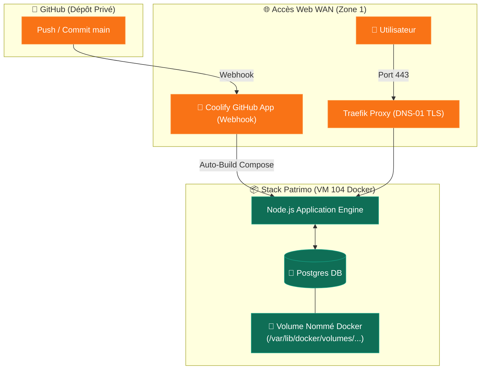

import { ips, domains } from "/snippets/variables.mdx";

<Badge color="green">🟢 Production Active</Badge>

## Accès Rapides & Administration

<Tabs>
  <Tab title="🌐 Interface Web">
    <Card title="Patrimo Web UI" icon="chart-pie" href="https://patrimo.ims-world.fr">
      Application web de gestion sur `patrimo.ims-world.fr`.
    </Card>
  </Tab>
  <Tab title="⚡ Commandes CLI & Maintenance">
    ```bash
    # Se connecter à la VM Coolify
    ssh cmolotkoff@100.64.0.4

    # Inspecter les logs des conteneurs applicatif et base de données
    docker ps -qf "name=patrimo" | xargs -I {} docker logs --tail 100 -f {}

    # Inspecter les volumes nommés Docker associés
    docker volume ls | grep patrimo
    docker volume inspect $(docker volume ls -q | grep patrimo)
    ```
  </Tab>
</Tabs>

---

## Fiche Service

| Propriété | Valeur |
|---|---|
| **Domaine** | `patrimo.ims-world.fr` |
| **Type de déploiement** | **Application Coolify** (Git Integration Build Strategy) |
| **Source Git** | Dépôt GitHub privé (Projet personnel) |
| **Méthode de Build** | Docker Compose (`/docker-compose.yaml` dans le repo) |
| **Stack Technique** | Node.js + PostgreSQL |
| **Hôte d'Orchestration** | VM IMS-Coolify (VM 104) |
| **Stockage Base de Données** | Volume nommé Docker interne (`/var/lib/docker/volumes/...`) |
| **Statut** | <Badge color="green">🟢 Production Active</Badge> |

<Info>
Contrairement aux **Services Coolify** du homelab (déployés par du code Docker Compose statique dans Coolify), Patrimo est configuré sous forme d'**Application Coolify**. Le déploiement est automatique à chaque push sur la branche principale du dépôt GitHub via la GitHub App Coolify.
</Info>

---

## Architecture & Topologie



---

## Stockage & Politique de Sauvegarde

<Warning>
**Stockage en Volume Nommé Docker** : La base de données PostgreSQL de Patrimo utilise un volume Docker nommé géré en interne par le moteur Docker (`/var/lib/docker/volumes/.../_data`), plutôt qu'un point de montage bind-mount sous `/data/coolify/services/`.
</Warning>

<Info>
**Politique de Sauvegarde** : Les données actuelles de Patrimo étant non-critiques et s'agissant d'une installation neuve, ce volume nommé Docker n'est pas inclus dans la sauvegarde automatique Proxmox Backup Server (PBS). Si le projet évolue vers un stockage de données critiques, la base sera migrée vers un bind-mount dédié ou un dump automatisé.
</Info>
