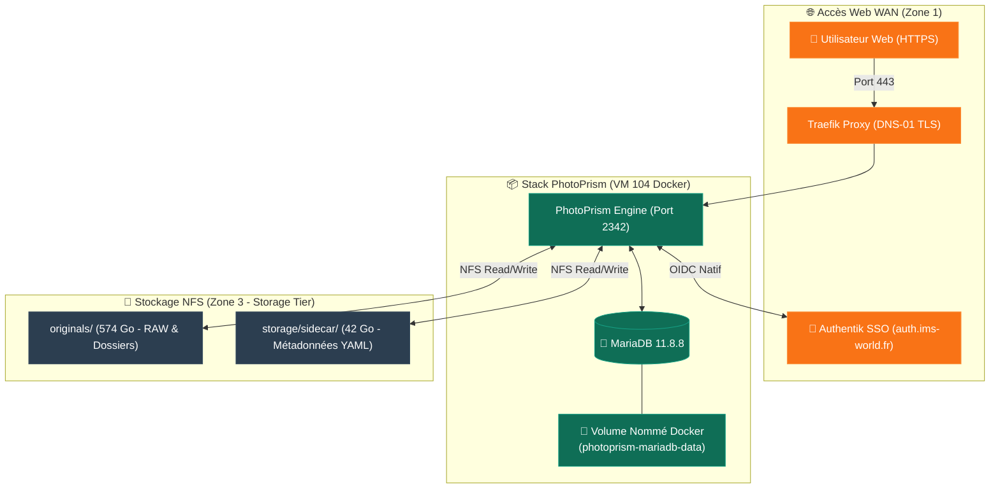

import { ips, domains } from "/snippets/variables.mdx";

<Badge color="green">🟢 Production Active</Badge>

## Accès Rapides & Administration

<Tabs>
  <Tab title="🌐 Interface Web">
    <Card title="PhotoPrism Web UI" icon="camera" href="https://studio.ims-world.fr">
      Bibliothèque photo & studio d'archivage sur `studio.ims-world.fr`.
    </Card>
  </Tab>
  <Tab title="⚡ Commandes CLI & Maintenance">
    ```bash
    # Se connecter à la VM Coolify
    ssh cmolotkoff@100.64.0.4

    # Inspecter les logs du conteneur PhotoPrism et de la base MariaDB
    docker ps -qf "name=photoprism" | xargs -I {} docker logs --tail 100 -f {}

    # Lancer une réindexation manuelle de la bibliothèque via CLI
    docker exec -it $(docker ps -qf "name=photoprism_photoprism") photoprism index

    # Traiter et importer immédiatement le dossier /import/ (dépôt WebDAV)
    docker exec -it $(docker ps -qf "name=photoprism_photoprism") photoprism import

    # Export / Dump de la base MariaDB (depuis l'hôte VM Coolify)
    docker exec $(docker ps -qf "name=photoprism_mariadb") mariadb-dump -u root -p"$DB_ROOT_PASSWORD" photoprism > photoprism_dump.sql
    ```
  </Tab>
</Tabs>

---

## Fiche Service

| Propriété | Valeur |
|---|---|
| **Domaine Web** | `studio.ims-world.fr` |
| **Rôle** | Bibliothèque de photos haute résolution et archivage RAW |
| **Image Docker PhotoPrism** | `photoprism/photoprism:260728` |
| **Image Docker MariaDB** | `mariadb:11.8.8` |
| **Hôte d'Orchestration** | VM IMS-Coolify (VM 104) |
| **UUID Coolify (MS-01)** | `yfotvbtkqj8cqw5alox6gfpr` |
| **Chemin sur la VM** | `/data/coolify/services/yfotvbtkqj8cqw5alox6gfpr/` |
| **Stockage Fichiers RAW** | NFS HDD `/mnt/nas-storage/photoprism-data/{originals,storage}` |
| **Stockage Base de Données** | Volume nommé Docker local (`photoprism-mariadb-data`) |
| **Authentification** | **SSO Authentik OIDC Natif** (client `photo-prism`, groupe `admins`) |
| **Statut** | <Badge color="green">🟢 Production Active</Badge> |

---

## Architecture & Topologie



---

## Architecture de Stockage (NFS vs Volume Nommé Docker)

- **Originaux & Métadonnées Sidecar sur NAS NFS (`storage` Tier)** :
  - `originals/` (~574 Go) : Contient la totalité des photos et fichiers RAW.
  - `storage/sidecar/` (~42 Go) : Contient l'ensemble des modifications et annotations manuelles de métadonnées (tags, visages, géolocalisation) sauvegardées au format YAML. **Conservation impérative**.
- **Base de Données MariaDB sur Volume Nommé Docker Local** :
  - La base MariaDB utilise un volume nommé Docker local (`photoprism-mariadb-data`) sur le SSD de la VM Coolify. Ce choix évite les verrous de fichiers InnoDB et les problèmes de performances I/O inhérents aux bases de données relationnelles sur NFS.

---

## Sécurité & SSO OIDC

L'accès à `studio.ims-world.fr` est sécurisé de manière native par OpenID Connect (OIDC) avec Authentik (`auth.ims-world.fr`) :
- Client OIDC Authentik : `photo-prism`
- Mapping automatique du groupe d'administration `admins`
- Mire de connexion PhotoPrism reliée directement au SSO central.

---

## Ingestion de Photos & WebDAV

<AccordionGroup>
  <Accordion title="Pourquoi utiliser WebDAV plutôt que le NAS (SMB/NFS)">
    PhotoPrism embarque son propre serveur WebDAV accessible en HTTPS sur `studio.ims-world.fr`. Il permet de déposer rapidement de gros volumes de fichiers RAW (cartes SD / appareils photo) depuis n'importe quel ordinateur sans devoir configurer de partages réseau locaux SMB/NFS.
  </Accordion>

  <Accordion title="Points d'Accès WebDAV (/import/ vs /originals/)">
    - **`/import/`** : Dossier de dépôt. Les fichiers y sont analysés, convertis si besoin (HEIC → JPG), organisés automatiquement par date dans la bibliothèque puis déplacés vers `originals/`.
    - **`/originals/`** : Accès direct à l'intégralité de la bibliothèque déjà indexée en lecture/écriture. Utile pour parcourir les photos depuis le Finder/Explorateur sans navigateur.
    
    <Warning>
    Ne pas déposer de nouvelles photos directement dans `/originals/`. Utiliser systématiquement `/import/` pour bénéficier du classement automatique par date.
    </Warning>
  </Accordion>

  <Accordion title="Authentification WebDAV & Piège OIDC">
    Les comptes utilisateur provisionnés via OIDC/Authentik n'ont pas de mot de passe local pour WebDAV.
    
    - **Option 1 (Compte Admin Local)** : Utiliser le compte `clement.molotkoff.admin` avec le mot de passe défini dans le `.env` (`PHOTOPRISM_ADMIN_PASSWORD`).
    - **Option 2 (App Password OIDC)** : Générer un mot de passe d'application dédié depuis l'interface web dans **Settings → Account → Apps and Devices**.
  </Accordion>

  <Accordion title="Procédure de Connexion (macOS & Windows)">
    - **macOS** : Finder → Menu **Aller → Se connecter au serveur…** (`Cmd+K`) → Entrer `https://studio.ims-world.fr/import/` (ou `/originals/`) → Renseigner les identifiants.
    - **Windows** : Explorateur → **Connecter un lecteur réseau** → *Se connecter à un site Web pour stocker vos documents* → Entrer l'URL WebDAV au format Windows fournie dans **Settings → Account → Connect via WebDAV**.
  </Accordion>

  <Accordion title="Déclenchement Manuel de l'Import (AppleDouble & Delais)">
    <Warning>
    Sur macOS, le Finder génère des fichiers cachés `._` (métadonnées AppleDouble) qui peuvent retarder l'auto-indexation automatique (jusqu'à 20+ minutes). Il est vivement recommandé de forcer l'importation immédiatement après un dépôt.
    </Warning>

    ```bash
    # Exécuter sur la VM Coolify pour lancer l'importation immédiate du dossier /import/
    docker exec -it $(docker ps -qf "name=photoprism_photoprism") photoprism import
    ```
  </Accordion>

  <Accordion title="Accélération GPU FFmpeg & Statut Transcodage (iGPU Iris Xe)">
    ```yaml
    services:
      photoprism:
        devices:
          - /dev/dri:/dev/dri
        environment:
          PHOTOPRISM_FFMPEG_ENCODER: intel
          PHOTOPRISM_INIT: 'intel tensorflow'
    ```

    <Warning>
    **Piège `PHOTOPRISM_INIT`** : La variable `PHOTOPRISM_INIT` **doit impérativement inclure `intel`** (en plus de `tensorflow`). Sans cela, les paquets système nécessaires à FFmpeg pour piloter le périphérique `/dev/dri` (VA-API / QuickSync) ne sont pas installés dans le conteneur, et PhotoPrism retombe silencieusement sur l'encodeur logiciel `libx264` sans message d'erreur explicite.
    </Warning>

    <Info>
    **Retour d'Expérience & Transcodage Vidéo** : Après application de la configuration `intel`, le chargement des vidéos est perçu comme plus fluide. Cependant, aucun flag hardware explicite n'a été observé sur les processus `ffmpeg`. De nombreuses issues GitHub récentes (2025-2026) signalent des échecs récurrents de session MFX/QSV sur les processeurs récents Intel (`Error creating a MFX session`). L'accélération GPU pour le labeling/reconnaissance faciale a également été écartée (fonctionnalité historiquement CPU, délester sur serveur distant étant réservé à la version Pro payante). Voir l'[ADR-008 — GPU Passthrough](/history/adr/adr-008-passthrough-gpu-igpu-iris-xe).
    </Info>
  </Accordion>
</AccordionGroup>

---
*Dernière révision de cette fiche : 17 août 2026*
