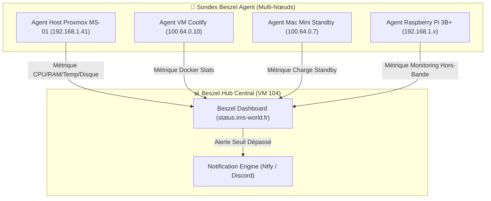

<Info>
⏳ **Statut : Planifié (Feuille de Route 2026)** — Solution de monitoring ultra-léger et moderne (agent Rust/Go + dashboard Web) pour suivre la charge du MS-01, du Mac Mini et des conteneurs Docker.
</Info>

## Fiche Technique Prévisionnelle

| Propriété | Valeur Projetée |
|---|---|
| **Domaine Visé** | `status.ims-world.fr` |
| **Composants** | `beszel-hub` (Hub central) + `beszel-agent` (Sondes sur chaque hôte) |
| **Consommation** | < 15 MB RAM par agent |
| **Accès** | Restricted **Tailnet-only** via middleware `vpn-only` |
| **Statut** | ⏳ Feuille de Route |

## Architecture de Monitoring Multi-Hôtes

