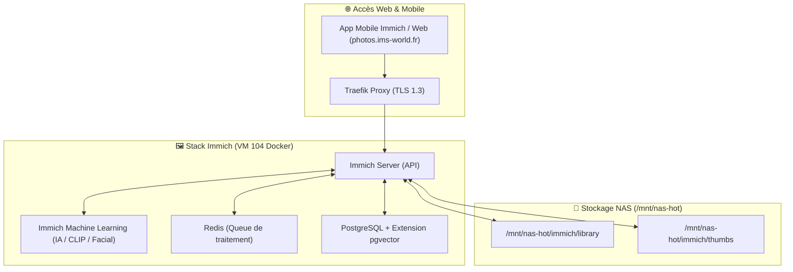

<Info>
⏳ **Statut : Planifié (Feuille de Route 2026)** — Application de gestion et sauvegarde automatique de photos/vidéos mobiles, avec reconnaissance faciale IA et recherche vectorielle.
</Info>

## Fiche Technique Prévisionnelle

| Propriété | Valeur Projetée |
|---|---|
| **Domaine Visé** | `photos.ims-world.fr` |
| **Composants** | `immich-server` + `immich-microservices` + `immich-machine-learning` + PostgreSQL (pgvector) + Redis |
| **Stockage** | Données volumineuses hébergées sur le NAS (`/mnt/nas-storage/immich`) |
| **Authentification** | SSO OIDC via [Authentik](/services/authentik) |
| **Statut** | ⏳ Feuille de Route |

## Architecture Projetée

