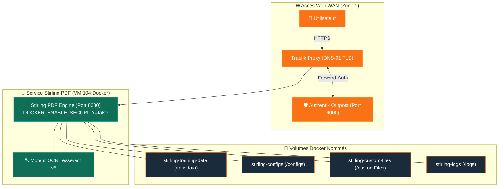

import { ips, domains } from "/snippets/variables.mdx";

<Badge color="green">🟢 Production Active</Badge>

## Accès Rapides & Administration

<Tabs>
  <Tab title="🌐 Interface Web">
    <Card title="Stirling PDF Web UI" icon="file-pdf" href="https://pdf.ims-world.fr">
      Interface web de traitement et manipulation de fichiers PDF sur `pdf.ims-world.fr` (protégée par SSO Authentik).
    </Card>
  </Tab>
  <Tab title="⚡ Commandes CLI & Maintenance">
    ```bash
    # Se connecter à la VM Coolify
    ssh cmolotkoff@100.64.0.4

    # Accéder au dossier du service Stirling PDF
    cd /data/coolify/services/p6lm9p4zf1caqruekeuocnje/

    # Inspecter les logs du conteneur
    docker compose logs -f --tail=100

    # Redémarrer le service
    docker restart $(docker ps -qf "name=stirling-pdf")
    ```
  </Tab>
</Tabs>

---

## Fiche Service

| Propriété | Valeur |
|---|---|
| **Domaine** | `pdf.ims-world.fr` |
| **Rôle** | Manipulation de documents PDF (OCR, fusion, découpe, conversion) |
| **Image Docker** | `stirlingtools/stirling-pdf:latest` |
| **Architecture** | Stateless (pas de base de données requise) |
| **Hôte d'Orchestration** | VM IMS-Coolify (VM 104) |
| **UUID Coolify** | `p6lm9p4zf1caqruekeuocnje` |
| **Chemin sur la VM** | `/data/coolify/services/p6lm9p4zf1caqruekeuocnje/` |
| **Authentification** | **Forward-Auth Authentik Outpost** (`ak-outpost-ims-outpost:9000`) |
| **Statut** | <Badge color="green">🟢 Production Active</Badge> |

---

## Architecture & Topologie



---

## Stockage & Organisation des Volumes

En tant que service *stateless*, Stirling PDF ne conserve pas de documents utilisateurs de manière permanente. Les données sont traitées à la volée en mémoire temporaire.

| Volume Docker | Emplacement Conteneur | Usage |
|---|---|---|
| `stirling-training-data` | `/usr/share/tesseract-ocr/5/tessdata` | Modèles de reconnaissance de caractères OCR (langues) |
| `stirling-configs` | `/configs` | Fichiers de configuration système et préférences |
| `stirling-custom-files` | `/customFiles/` | Éléments visuels et personnalisations d'interface |
| `stirling-logs` | `/logs/` | Journaux d'exécution du serveur web Java/Spring |

---

## Sécurité & Authentification

### 1. Authentik Forward-Auth Outpost
Stirling PDF est protégé en amont par l'**Outpost Forward-Auth Authentik** (`ak-outpost-ims-outpost:9000`) et son Provider dédié `IMS-StrilingPDF-Provider`. Toute requête vers `pdf.ims-world.fr` exige une session Authentik active. Pour le détail du fonctionnement de l'Outpost Proxy, voir la fiche [Authentik](/services/authentik#outpost-proxy--forward-auth).

### 2. Désactivation de la Sécurité Native (`DOCKER_ENABLE_SECURITY=false`)

<Info>
La variable d'environnement **`DOCKER_ENABLE_SECURITY=false`** désactive le système de login/mot de passe interne propre à Stirling PDF. L'accès étant déjà intégralement contrôlé en amont par Authentik, cette désactivation évite d'imposer une double mire d'authentification inutile à l'utilisateur.
</Info>
