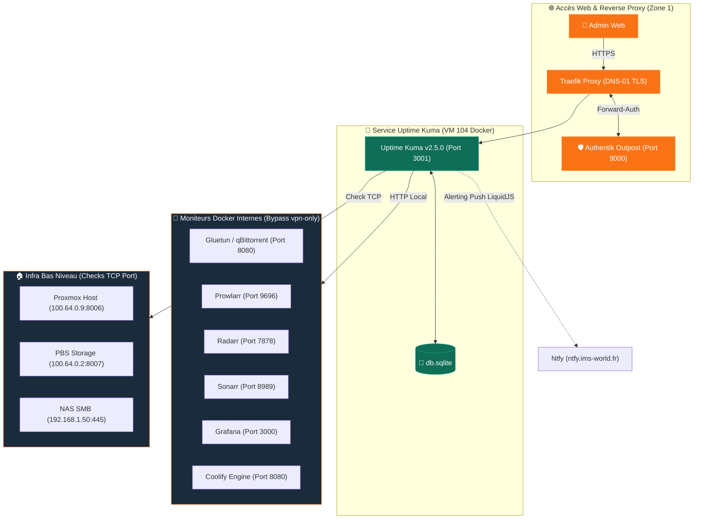

import { ips, domains } from "/snippets/variables.mdx";

<Badge color="green">🟢 Production Active (v2.5.0)</Badge>

## Accès Rapides & Administration

<Tabs>
  <Tab title="🌐 Interface Web">
    <Card title="Uptime Kuma Web UI" icon="heart-pulse" href="https://status.ims-world.fr">
      Console de monitoring actif et gestion des moniteurs HTTP/TCP sur `status.ims-world.fr` (protégée par SSO Authentik Outpost).
    </Card>
  </Tab>
  <Tab title="⚡ Commandes CLI & Maintenance">
    ```bash
    # Se connecter à la VM Coolify
    ssh cmolotkoff@100.64.0.4

    # Accéder au dossier du service Uptime Kuma
    cd /data/coolify/services/il53bmpdybmss5q14sfy0umm/

    # Inspecter les logs du conteneur
    docker compose logs -f --tail=100

    # Redémarrer Uptime Kuma après création d'une étiquette (contournement du bug Prometheus)
    docker restart $(docker ps -qf "name=uptime-kuma")
    ```
  </Tab>
</Tabs>

---

## Fiche Service

| Propriété | Valeur |
|---|---|
| **Domaine** | `status.ims-world.fr` |
| **Rôle** | Surveillance active de disponibilité (HTTP/TCP) & Alerting Ntfy |
| **Version** | `louislam/uptime-kuma:2.5.0` (version stable figée) |
| **Base de Données** | SQLite |
| **Hôte d'Orchestration** | VM IMS-Coolify (VM 104) |
| **UUID Coolify** | `il53bmpdybmss5q14sfy0umm` |
| **Chemin sur la VM** | `/data/coolify/services/il53bmpdybmss5q14sfy0umm/` |
| **Authentification** | **Forward-Auth Authentik Outpost** (`ak-outpost-ims-outpost:9000`) |
| **Statut** | <Badge color="green">🟢 Production Active</Badge> |

<Info>
Uptime Kuma a été retenu pour son alerting Ntfy réactif et sa capacité à corréler la disponibilité globale avec la stack de métrologie Grafana/Loki/Prometheus déployée en parallèle.
</Info>

---

## Architecture & Topologie



---

## Composants & Stratégie de Monitoring

### 1. Moniteurs Internes Docker (Bypass du Middleware `vpn-only`)

<Warning>
**Contrainte Réseau Réseau Interne vs Tailnet** : Uptime Kuma s'exécute sur le réseau Docker interne de la VM 104, et non sur le Tailnet. S'il interroge un domaine externe filtré par le middleware Traefik `vpn-only` (`100.64.0.0/10`), son IP source interne est rejetée en **HTTP 403 Forbidden** (fausse alerte "DOWN").

**Solution** : Cibler directement les noms de conteneurs/services Docker sur le réseau interne.
</Warning>

| Service Cible | URL de Monitoring Interne | Note Réseau |
|---|---|---|
| **qBittorrent** | `http://gluetun-w39uebmcnse7yctsft8hzed8:8080` | Interroger Gluetun (`network_mode: "service:gluetun"` car qBit partage sa stack réseau) |
| **Prowlarr** | `http://prowlarr-w39uebmcnse7yctsft8hzed8:9696` | Conteneur Prowlarr interne |
| **Radarr** | `http://radarr-w39uebmcnse7yctsft8hzed8:7878` | Conteneur Radarr interne |
| **Sonarr** | `http://sonarr-w39uebmcnse7yctsft8hzed8:8989` | Conteneur Sonarr interne |
| **Grafana** | `http://grafana-rrw19kmye6gng961igtzqpgw:3000` | Conteneur Grafana interne |
| **Coolify** | `http://coolify:8080` | Engine Coolify interne |

### 2. Moniteurs Publics WAN (Domaines HTTPS)

Les services publics WAN (Authentik, Vaultwarden, Headscale, Jellyfin, Jellyseerr, Immich, Ntfy) sont surveillés directement via leurs FQDNs publics (`https://*.ims-world.fr`).

### 3. Checks Infra Bas Niveau (TCP Port vs ICMP Ping)

<Warning>
Un simple ping ICMP confirme que la machine physique est allumée, mais ne garantit pas que le service applicatif répond. Préférer systématiquement un test de type **TCP Port** sur le port exact.
</Warning>

| Cible | Hôte : Port | Type de Check |
|---|---|---|
| **Host Proxmox MS-01** | `100.64.0.9:8006` | TCP Port |
| **PBS Storage** | `100.64.0.2:8007` | TCP Port |
| **NAS Storage (SMB)** | `192.168.1.50:445` | TCP Port |

---

## Stockage & Politique de Sécurité

### 1. Authentification Forward-Auth Authentik
Uptime Kuma ne disposant pas de support OIDC natif, l'accès à `status.ims-world.fr` est sécurisé par l'outpost Forward-Auth Authentik. Pour la configuration détaillée de l'outpost, voir la fiche [Authentik](/services/authentik#outpost-proxy--forward-auth).

```yaml
labels:
  - 'traefik.http.middlewares.authentik-kuma.forwardauth.address=http://ak-outpost-ims-outpost:9000/outpost.goauthentik.io/auth/traefik'
  - traefik.http.middlewares.authentik-kuma.forwardauth.trustForwardHeader=true
  - 'traefik.http.middlewares.authentik-kuma.forwardauth.authResponseHeaders=X-authentik-username,X-authentik-groups,X-authentik-email,X-authentik-uid'
  - traefik.http.routers.uptime-kuma.middlewares=authentik-kuma@docker
```

<Info>
Dans le Provider Authentik correspondant, la variable **External host** est configurée sur `https://status.ims-world.fr`.
</Info>

### 2. Bug Connus — Export Metrics Prometheus

<Warning>
**Bug `Added label X is not included in initial labelset`** : Ajouter une nouvelle étiquette (tag) dans Uptime Kuma alors que l'export Prometheus `/metrics` est actif fait planter le serveur d'export de métriques.

**Contournement** : Exécuter `docker restart <container_uptime_kuma>` après toute création d'étiquette. Cela relance l'export sans impacter les moniteurs ni les alertes Ntfy.
</Warning>

---

## Alerting & Templates Ntfy (LiquidJS)

L'alerting Uptime Kuma transmet ses notifications push vers **[Ntfy](/services/ntfy)** sur le topic `ims-alerts` avec un token d'API dédié et la priorité **Urgent**.

### Templates LiquidJS Personnalisés

- **Titre (Subject)** :
  ```liquid
  🔴 PANNE✅ RÉTABLIℹ️ {{ status }} — {{ name }}
  ```

- **Message** :
  ```liquid
  {{ name }} ({{ hostnameOrURL }})
  {{ msg }}
  Latence : {{ heartbeatJSON.ping }} ms
  ```

<Check>
Validé en conditions réelles lors d'un test d'interruption : notification `🔴 PANNE` immédiatement reçue, suivie de `✅ RÉTABLI` avec mesure de la latence en millisecondes.
</Check>
