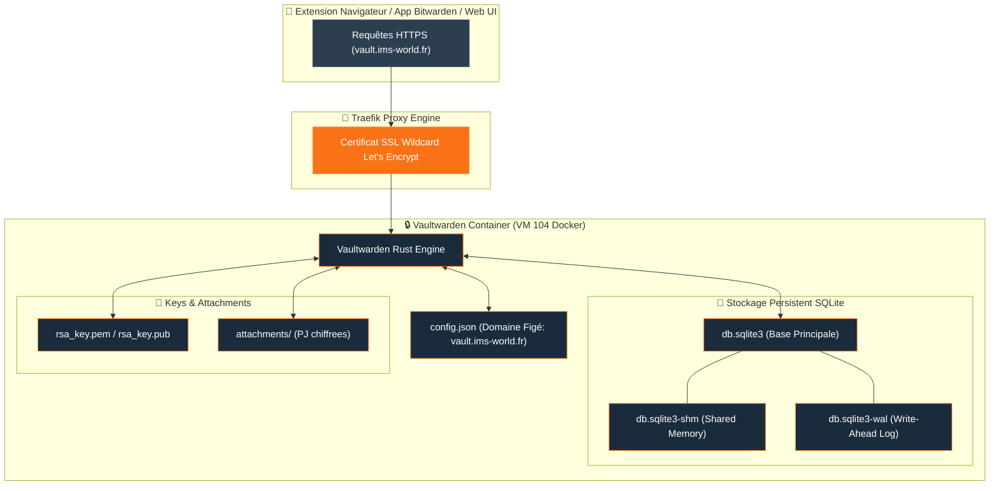

## Accès & Sauvegarde Coffre-Fort

<Tabs>
  <Tab title="🌐 Interface Web Vaultwarden">
    <Card title="Vaultwarden Web Vault" icon="shield-halved" href="https://vault.ims-world.fr">
      Coffre-fort de mots de passe compatible Bitwarden. Accessible sur `vault.ims-world.fr`.
    </Card>
  </Tab>
  <Tab title="💾 Backup SQLite WAL Sécurisé">
    ```bash
    # Arrêt bref du container pour figer la mémoire partagée WAL
    docker stop vaultwarden-i5ae953riutbot9afjcboptb
    
    # Archivage du dossier data persistent
    sudo tar czf ~/vaultwarden-data.tar.gz -C /data/coolify/services/i5ae953riutbot9afjcboptb/data .
    
    # Redémarrage du service
    docker start vaultwarden-i5ae953riutbot9afjcboptb
    ```
  </Tab>
  <Tab title="🛠️ Correctif Domaine config.json">
    ```bash
    # Modifier le domaine figé dans config.json
    sed -i 's|https://vault-ng.ims-world.fr|https://vault.ims-world.fr|' \
      /data/coolify/services/i5ae953riutbot9afjcboptb/data/config.json
    
    docker restart vaultwarden-i5ae953riutbot9afjcboptb
    ```
  </Tab>
</Tabs>

## Fiche Service

| Propriété | Valeur |
|---|---|
| **Domaine** | `vault.ims-world.fr` |
| **Base de données** | SQLite (mode WAL) |
| **UUID Coolify** | `i5ae953riutbot9afjcboptb` |
| **Chemin sur la VM** | `/data/coolify/services/i5ae953riutbot9afjcboptb/` |
| **Statut** | 🟢 Production |

## Topologie Vaultwarden & Stockage WAL



<Warning>
Mapping Authentik custom requis pour `email_verified: true` — sans lui, le SSO OIDC casse silencieusement.
</Warning>

## Retours d'Expérience & Particularités Techniques

<AccordionGroup>
  <Accordion title="Sauvegarde & Consistance SQLite WAL">
    <Warning>
    Contrairement à Postgres (dump à chaud sans souci), une base SQLite en mode WAL (`db.sqlite3-shm`/`-wal` présents) nécessite un **arrêt bref du service** le temps de l'archivage/sauvegarde — sinon risque de base incohérente.
    </Warning>

    <Info>
    Fichiers source appartenant à `root` sur l'ancien serveur, sans SSH root disponible dans le sens Mac Mini→VM. Contournement : `sudo tar` côté source + `scp` dans le sens qui fonctionne (VM→Mac Mini).
    </Info>
  </Accordion>

  <Accordion title="Piège découvert — config.json à domaine figé">
    <Warning>
    `config.json` de Vaultwarden contient le domaine **en dur**, qui **prend le pas sur toute variable d'environnement Coolify** (confirmé par le warning dans les logs de démarrage : *"The following environment variables are being overridden by the config.json file"*).

    Sans correction : page blanche en chargement infini (requêtes API bloquées côté navigateur, CORS avec le mauvais domaine).
    </Warning>

    <Tip>
    Après correction du domaine, un écran encore bloqué n'est pas forcément une vraie erreur — vérifier le **cache navigateur** (hard refresh, Cmd+Shift+R) avant de creuser plus loin. Ce piège s'est reproduit une seconde fois sur HomeFlix/Jellyfin.
    </Tip>

    Ce même piège de fichier de config à domaine figé a été retrouvé sur qBittorrent (voir [HomeFlix](/services/homeflix)) — pattern à vérifier systématiquement sur tout nouveau service migré.
  </Accordion>
</AccordionGroup>
