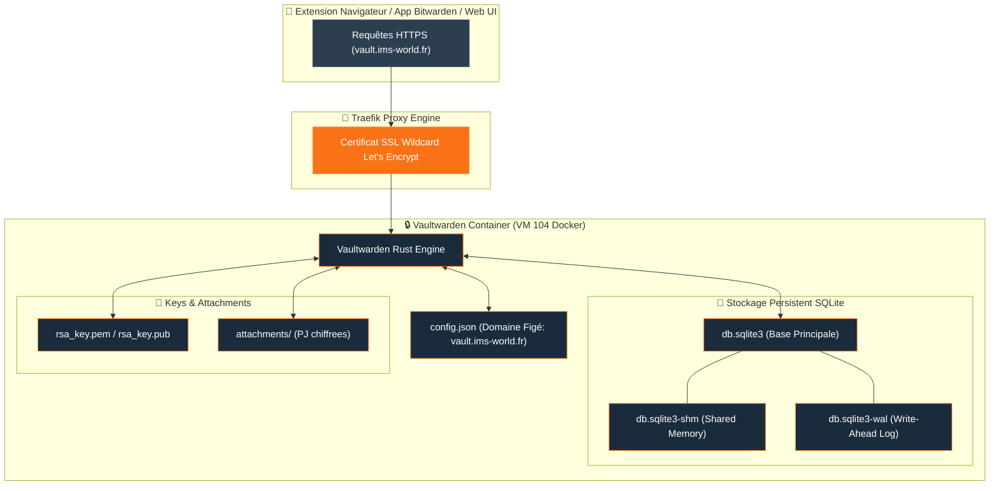

import { ips, domains } from "/snippets/variables.mdx";

<Badge color="green">🟢 Production Active</Badge>

## Accès & Sauvegarde Coffre-Fort

<Tabs>
  <Tab title="🌐 Interface Web Vaultwarden">
    <Card title="Vaultwarden Web Vault" icon="shield-halved" href="https://vault.ims-world.fr">
      Coffre-fort de mots de passe compatible Bitwarden. Accessible sur `vault.ims-world.fr`.
    </Card>
  </Tab>
  <Tab title="💾 Backup SQLite WAL Sécurisé">
    ```bash
    # Arrêt bref du container pour figer la mémoire partagée WAL
    docker stop vaultwarden-i5ae953riutbot9afjcboptb
    
    # Archivage du dossier data persistent
    sudo tar czf ~/vaultwarden-data.tar.gz -C /data/coolify/services/i5ae953riutbot9afjcboptb/data .
    
    # Redémarrage du service
    docker start vaultwarden-i5ae953riutbot9afjcboptb
    ```
  </Tab>
</Tabs>

## Fiche Service

| Propriété | Valeur |
|---|---|
| **Domaine** | `{domains.vaultwarden}` |
| **Rôle** | Gestionnaire de Mots de Passe Chiffré |
| **Base de Données** | SQLite (mode Write-Ahead Log WAL) |
| **Hôte d'Orchestration** | VM IMS-Coolify (VM 104) |
| **UUID Coolify** | `i5ae953riutbot9afjcboptb` |
| **Chemin sur la VM** | `/data/coolify/services/i5ae953riutbot9afjcboptb/` |
| **Statut** | <Badge color="green">🟢 Production Active</Badge> |

---

## Topologie Vaultwarden & Stockage WAL



<Warning>
Mapping Authentik custom requis pour `email_verified: true` — sans lui, le SSO OIDC casse silencieusement.
</Warning>
