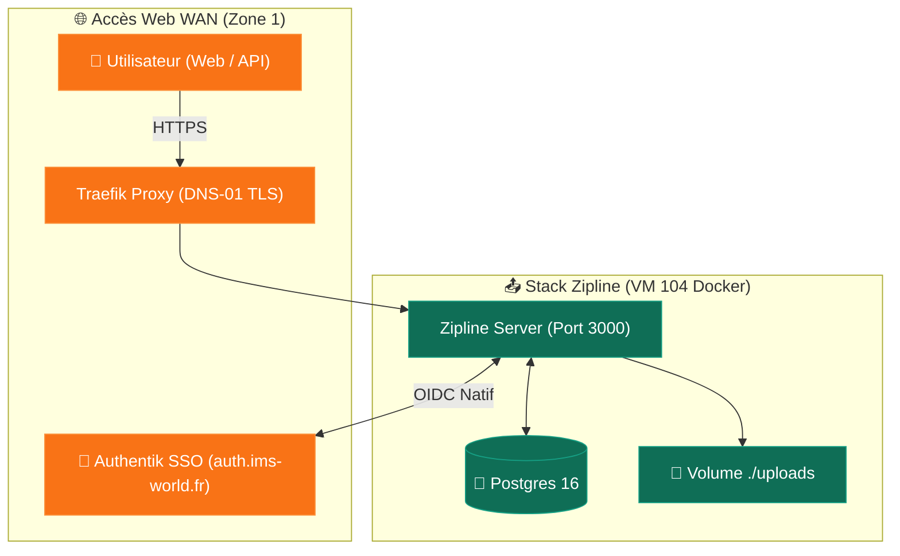

import { ips, domains } from "/snippets/variables.mdx";

<Badge color="green">🟢 Production Active</Badge>

## Accès Rapides & Administration

<Tabs>
  <Tab title="🌐 Interface Web">
    <Card title="Zipline Web UI" icon="share-nodes" href="https://share.ims-world.fr">
      Plateforme de partage de fichiers, hébergement d'images ShareX et raccourcisseur d'URLs sur `share.ims-world.fr` (SSO Authentik).
    </Card>
  </Tab>
  <Tab title="⚡ Commandes CLI & Maintenance">
    ```bash
    # Se connecter à la VM Coolify
    ssh cmolotkoff@100.64.0.4

    # Accéder au dossier du service Zipline
    cd /data/coolify/services/kbcknnnkswmcnlgmupxoyheh/

    # Inspecter les logs du conteneur applicatif et de la base Postgres
    docker compose logs -f --tail=100
    ```
  </Tab>
</Tabs>

---

## Fiche Service

| Propriété | Valeur |
|---|---|
| **Domaine** | `share.ims-world.fr` |
| **Rôle** | Partage de fichiers, captures d'écran ShareX et raccourcisseur de liens |
| **Image Docker** | `ghcr.io/diced/zipline:latest` |
| **Base de Données** | PostgreSQL 16 (`postgres:16-alpine`) |
| **Hôte d'Orchestration** | VM IMS-Coolify (VM 104) |
| **UUID Coolify** | `kbcknnnkswmcnlgmupxoyheh` |
| **Chemin sur la VM** | `/data/coolify/services/kbcknnnkswmcnlgmupxoyheh/` |
| **Stockage** | Bind-mounts locaux (`./uploads` et `./postgres`) |
| **Authentification** | **SSO Authentik OIDC Natif** |
| **Statut** | <Badge color="green">🟢 Production Active</Badge> |

---

## Architecture & Topologie



<Info>
Zipline supporte l'envoi de captures d'écran et de fichiers via des clients tiers (comme **ShareX** sous Windows ou des utilitaires CLI/scripts). Les téléversements automatisés s'effectuent via l'API Zipline en utilisant des jetons d'accès ou des en-têtes d'autorisation dédiés.
</Info>

---

## Composants & Stockage

| Conteneur / Volume | Image ou Chemin | Rôle |
|---|---|---|
| **`zipline`** | `ghcr.io/diced/zipline:latest` | Application web et API de partage de fichiers |
| **`postgres`** | `postgres:16-alpine` | Base de données PostgreSQL v16 |
| **`./uploads`** | Bind-mount hôte | Stockage des fichiers et images uploadés |
| **`./postgres`** | Bind-mount hôte | Données de la base de données PostgreSQL |

---

## Sécurité & Authentification

- **Authentification OIDC Native** : Zipline gère son authentification directement en OIDC avec Authentik (via OAuth Provider), sans nécessiter le middleware Forward-Auth Outpost.
- **Résolution Inter-Conteneurs (`host-gateway`)** : Le conteneur résout directement `auth.ims-world.fr` pour valider les jetons OAuth d'Authentik.
- **Tag d'image `latest`** : L'équipe Zipline ne publiant pas de tags de version spécifiques par release, l'image utilise le tag `latest`.
